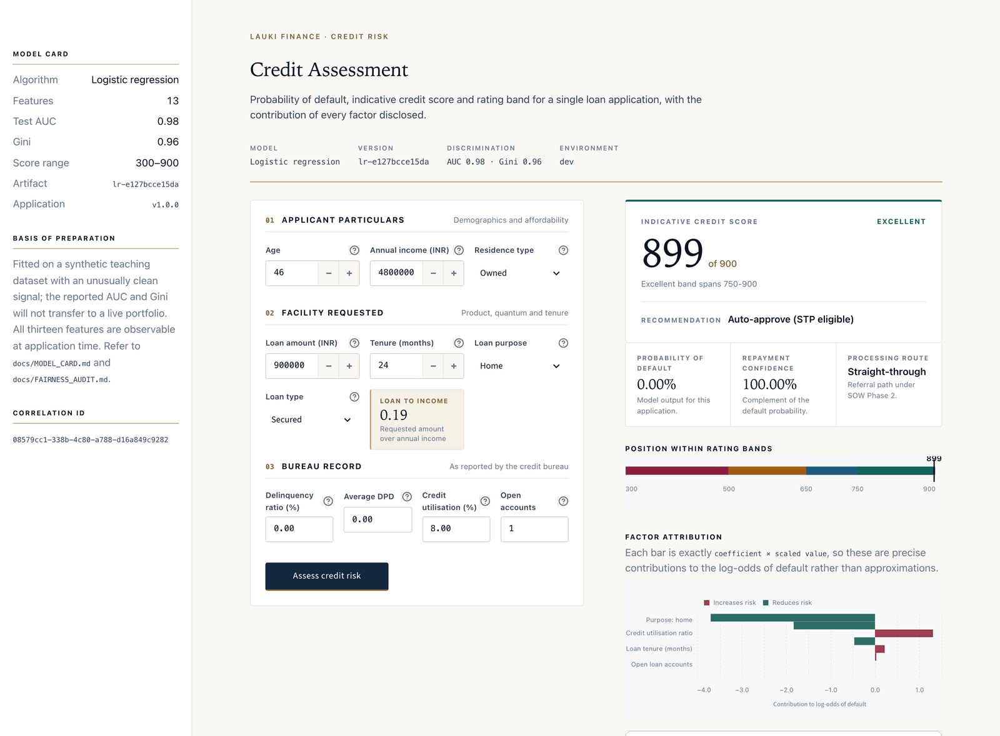
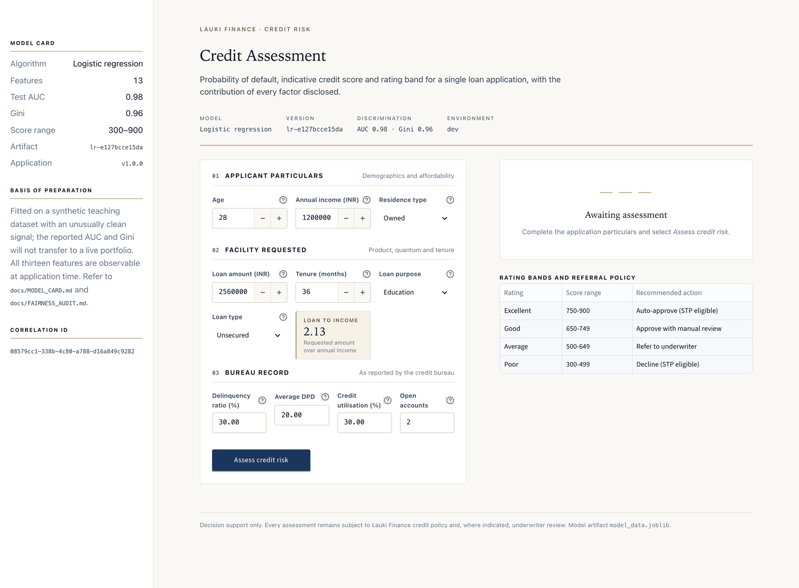
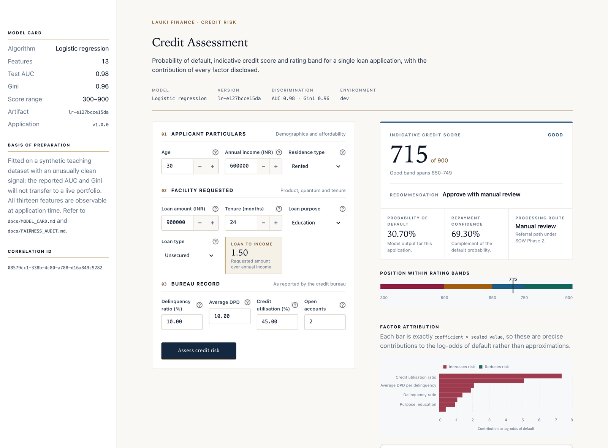
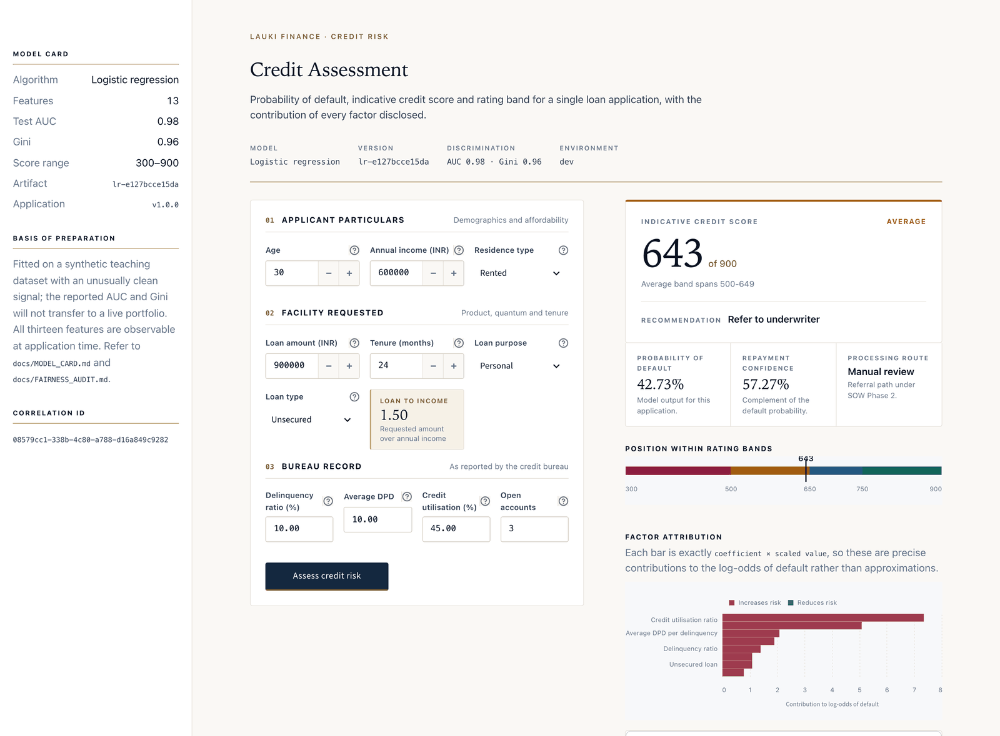
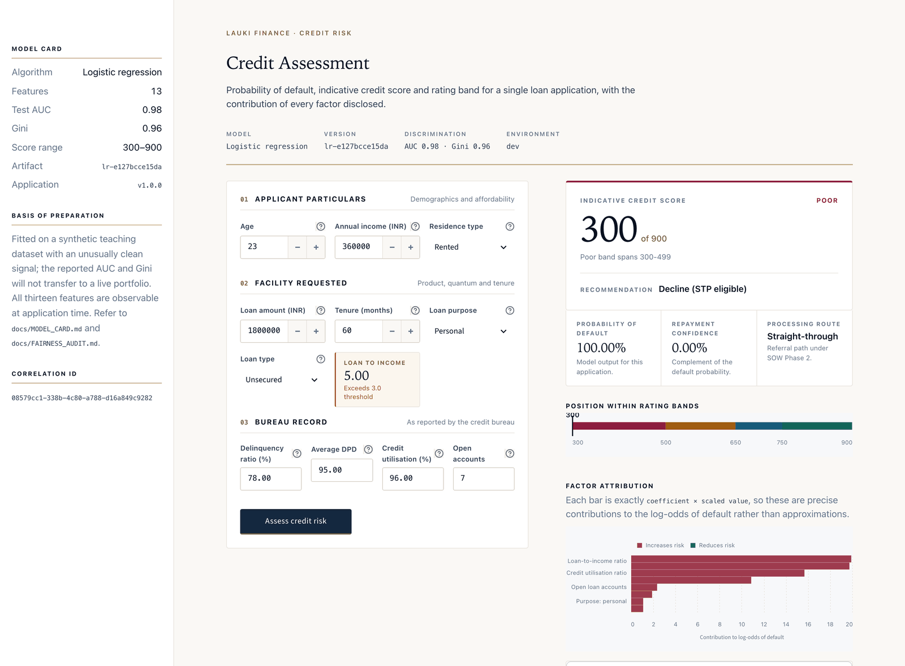
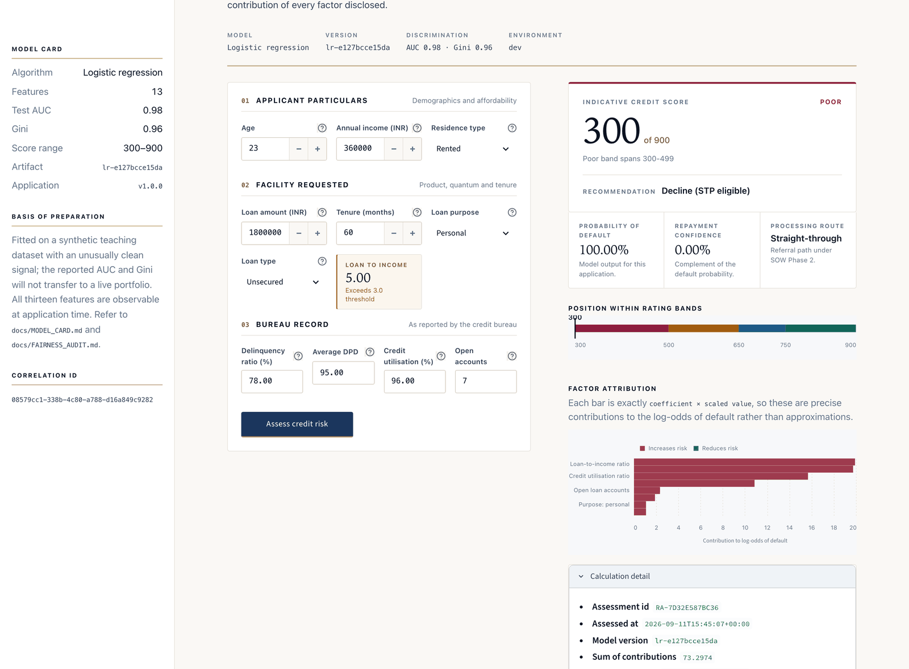
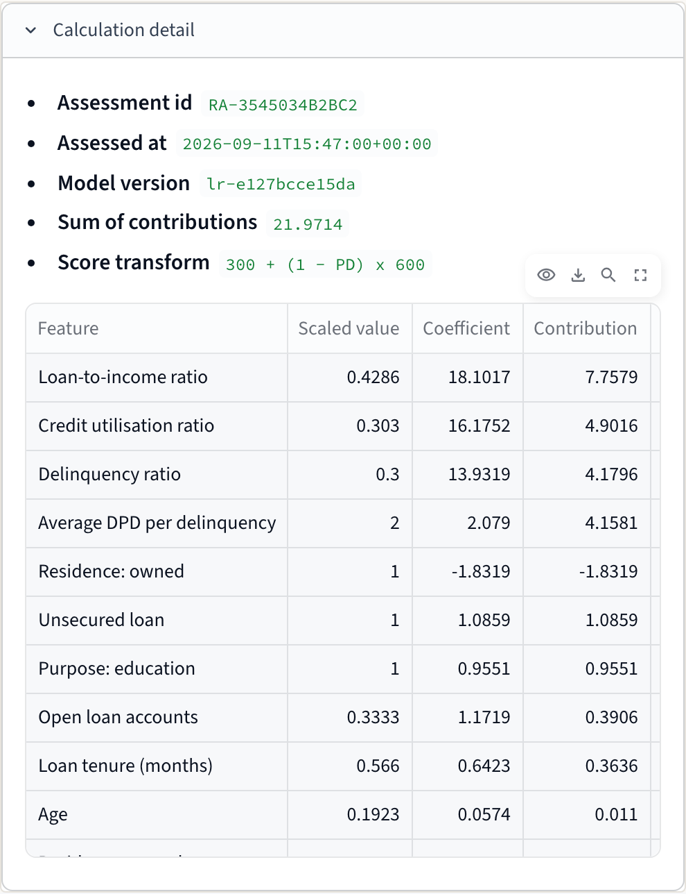
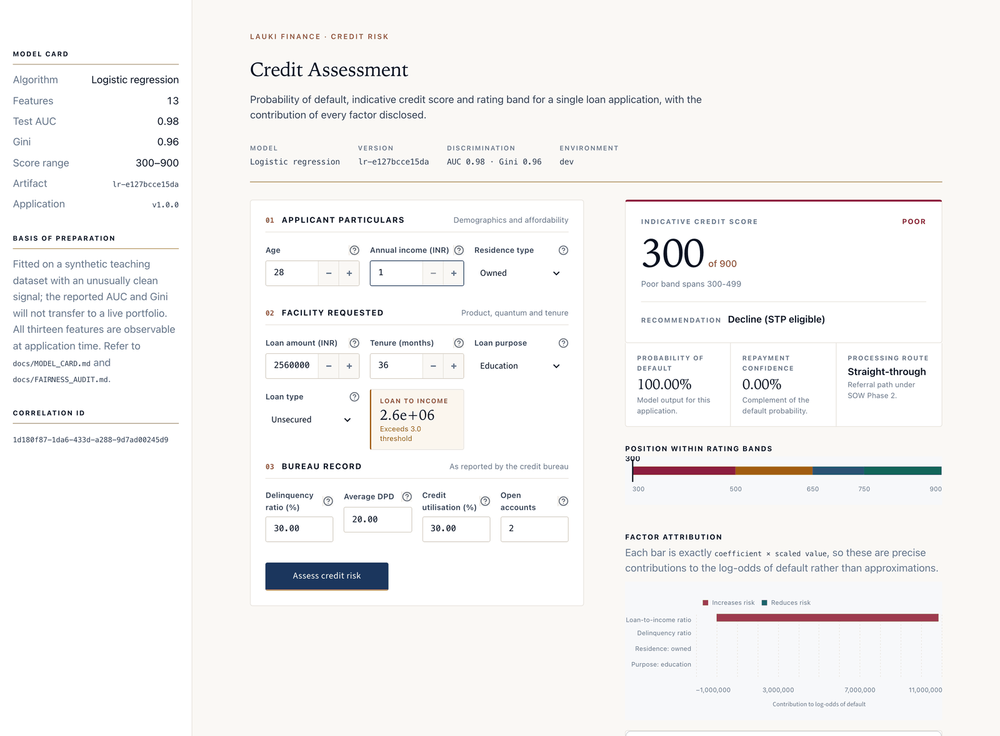
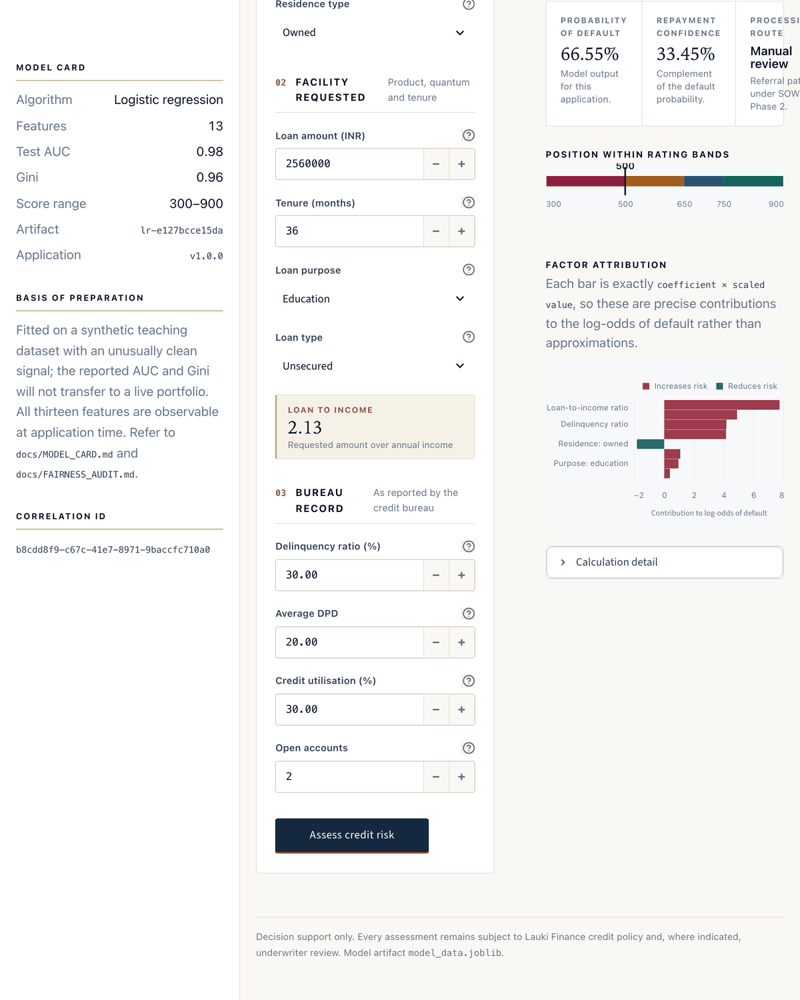
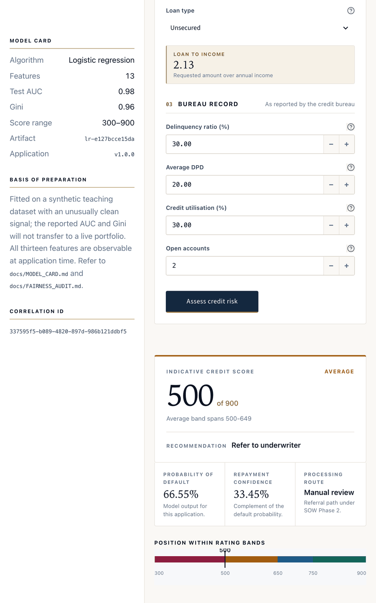

# Credit Risk Scorecard — Lauki Finance

Real-time credit risk assessment for loan applications. Given an applicant's
profile, loan request and bureau history, it returns a **probability of
default**, a **CIBIL-like credit score (300–900)**, a **rating band**, and an
**exact explanation** of what drove the decision.

Built to the Phase 1 scope of a credit-risk SOW for a fictional NBFC ("Lauki
Finance"), from the Codebasics ML course.



---

## Interface

Assessment form on the left, verdict on the right. Every field carries a
tooltip, and loan-to-income is derived live as the amount and income change.



### The four rating bands

The same layout across the full risk spectrum. The verdict panel's top rule and
the score take the band's colour, so the outcome is legible before any text is
read.

| | |
|---|---|
| **Excellent** · 899 · PD 0.00% · auto-approve | **Good** · 715 · PD 30.70% · approve with review |
|  |  |
| **Average** · 643 · PD 42.73% · refer to underwriter | **Poor** · 300 · PD 100.00% · decline |
|  |  |

### Explainability

Because the model is a logistic regression, each bar is exactly
`coefficient × scaled value` — the model's own arithmetic, not a post-hoc
approximation. The table below the chart shows the full derivation per feature.



### Audit trail

Every assessment carries a correlation ID, the artifact version hash and the
model's provenance, so any decision can be reconstructed later.



### Validation

Inputs are validated at the boundary. Out-of-range values are rejected with a
typed `CRM-VAL-001` error rather than being silently coerced.



### Responsive layout

The grid collapses at 1100px and 720px, so the app stays usable on a tablet at
an officer's desk.

| Tablet (1000px) | Narrow (780px) |
|---|---|
|  |  |

---

## Quick start

```bash
cd Credit_Risk_Modelling

python3 -m venv .venv && source .venv/bin/activate
pip install -r requirements.txt

streamlit run app.py
```

The app opens at http://localhost:8501. No configuration is required — the
defaults are safe for local use.

To run the tests:

```bash
pip install -r requirements-dev.txt
pytest                       # everything
pytest -m "not integration"  # unit tests only, no disk access
pytest --cov=credit_risk --cov-report=term-missing
```

---

## What it does

| Output | Meaning |
|---|---|
| Probability of default | Direct model output for this application |
| Credit score | `300 + (1 − PD) × 600`, so higher is safer |
| Rating | Poor / Average / Good / Excellent |
| Recommended action | Decline · Refer · Approve with review · Auto-approve |
| Contributions | Per-feature effect on the log-odds of default |

Rating bands:

| Rating | Score | Recommended action |
|---|---|---|
| Excellent | 750–900 | Auto-approve (STP eligible) |
| Good | 650–749 | Approve with manual review |
| Average | 500–649 | Refer to underwriter |
| Poor | 300–499 | Decline (STP eligible) |

Because the model is a **logistic regression**, each contribution is exactly
`coefficient × scaled value`. The explanation is not an approximation — it
reconstructs the model's own arithmetic, which is what the SOW's
explainability requirement demands.

---

## Architecture

```
app.py                     Streamlit entry point
src/credit_risk/
├── config.py              Typed settings, validated at startup
├── errors.py              CRM-* error hierarchy
├── observability.py       structlog + Business Process Events
├── domain/                Framework-free core
│   ├── models.py            LoanApplication (aggregate root), value objects
│   └── scorecard.py         PD → score → rating band
├── scoring/               Inference
│   ├── artifact.py          Artifact loading + schema validation
│   ├── features.py          Domain → model matrix
│   ├── labels.py            Feature display labels
│   └── scorer.py            CreditRiskScorer
└── ui/                    Streamlit presentation
    ├── app.py               Composition root and control flow
    ├── panels.py            Presentational panels
    ├── inputs.py            Form assembly and validation
    ├── sections.py          Shared section headings + typed value carriers
    ├── bureau.py            Bureau-history input section
    ├── charts.py            Altair chart builders
    └── theme.py             Palette and stylesheet
```

Dependencies point inward only:

```
ui  →  scoring  →  domain
```

`domain` imports nothing from `scoring` or `ui`, and **Streamlit appears only
inside `ui`**. The scoring engine is therefore reusable as-is by the Phase 2
Straight-Through-Processing service — no rewrite, no framework untangling.

Wiring is constructor injection throughout; `build_scorer()` is the single
composition root. Every function is under 50 lines and every module under 300,
with cyclomatic complexity capped at 10 and enforced by `ruff`.

---

## Configuration

Every value comes from the environment with the `CRM_` prefix. Copy
`.env.example` to `.env` to override. Invalid configuration **crashes at
startup** with `CRM-INT-001` rather than defaulting silently.

| Key | Default | Valid range | Purpose |
|---|---|---|---|
| `CRM_ARTIFACT_PATH` | `artifacts/model_data.joblib` | readable path | Model bundle. Relative paths resolve to the project root |
| `CRM_APP_ENV` | `dev` | `dev`/`staging`/`production` | Non-dev forces JSON logs |
| `CRM_LOG_LEVEL` | `info` | `debug`/`info`/`warning`/`error` | Minimum log level |
| `CRM_LOG_JSON` | `false` | bool | Force JSON logs in dev |
| `CRM_BASE_SCORE` | `300` | 0–1000 | Lower bound of the score range |
| `CRM_SCALE_LENGTH` | `600` | 1–1000 | Width of the score range |
| `CRM_STP_ENABLED` | `true` | bool | Show STP eligibility |

Changing the calibration rescales the bands proportionally and rebuilds the
cached scorer.

---

## Error codes

| Code | Meaning | HTTP |
|---|---|---|
| `CRM-VAL-001` | Application failed validation | 400 |
| `CRM-NOT-001` | Model artifact not found | 404 |
| `CRM-EXT-001` | Artifact could not be deserialised | 503 |
| `CRM-CON-001` | Artifact violates the feature contract | 409 |
| `CRM-INT-001` | Invalid configuration at startup | 500 |
| `CRM-INT-002` | Scoring failed | 500 |

Nothing is swallowed: every external boundary (disk, joblib, sklearn) is
wrapped and re-raised as a typed error with the original cause attached.

---

## Observability

structlog, JSON outside development. One **L1** event per assessment
(`RISK_ASSESSMENT`, never sampled) and **L2** events for sub-operations
(`MODEL_ARTIFACT_LOAD`, `FEATURE_VECTOR_BUILD`, `SCORECARD_MAPPING`).

```json
{
  "timestamp": "2026-09-11T13:23:03.754282Z",
  "level": "info",
  "message": "credit-risk-scorecard | Event: RISK_ASSESSMENT SUCCESS | RA-C59818F1D9DF",
  "service": "credit-risk-scorecard",
  "correlationID": "610662e6-3bf3-4030-830f-dbc6a835559e",
  "event": {
    "domainId": "RA-C59818F1D9DF",
    "domainType": "LOAN_APPLICATION",
    "eventName": "RISK_ASSESSMENT",
    "status": "SUCCESS",
    "statusMessage": "Assessed as Good"
  },
  "creditScore": 658,
  "probabilityOfDefault": 0.401796
}
```

One `correlationID` per session, minted once and never regenerated. **No PII is
logged** — no names, no zip codes, no raw monetary values.

---

## Testing

243 tests, 98% coverage. Every non-UI module — `config`, `errors`,
`observability`, `domain/*`, `scoring/*` — is at **100%**.

- **Unit** — scorecard band edges, validation rejections, feature contract,
  error codes, config validation, chart specs. All I/O mocked.
- **Integration** — loads the real artifact and asserts numeric parity with the
  original prototype (`< 1e-9`), monotonicity (worse inputs never score
  higher), and drives the live Streamlit app via `AppTest`.

Naming follows `should_<action>_with<Condition>_<expectedResult>`.

---

## Known limitations

Read `docs/MODEL_CARD.md` before trusting the headline metrics, and
`docs/FAIRNESS_AUDIT.md` for disparate-impact and calibration analysis
(reproduce with `python3 scripts/fairness_audit.py`). In short:

1. **Synthetic data, not leakage.** An earlier draft of this README claimed
   target leakage via `delinquency_ratio` / `avg_dpd_per_delinquency`. That
   claim was tested against the data and **withdrawn**: the bureau table
   describes ~3.5 accounts per customer at *other* lenders (only 1 loan is held
   with Lauki Finance), `total_loan_months` averages 76 against this loan's 26,
   and dropping both features moves AUC only 0.983 → 0.938. They are valid
   application-time CIBIL-style inputs. The real caveat is that this is a
   **synthetic teaching dataset** with an unusually clean signal, so AUC 0.98 /
   Gini 0.96 will not transfer to a live portfolio.
2. **Bureau vintage is unverifiable from the data.** `bureau_data.csv` has no
   as-of date, so pre-decision timing cannot be proven from the file alone.
   Confirm with the data owner before production.
3. **Scaler placeholder debt.** The persisted scaler was fitted on 18 columns
   but the model consumes 13. The 11 extras are supplied as named placeholders
   and dropped immediately after scaling — isolated in `scoring/features.py`.
4. **Version skew.** The artifact was pickled with scikit-learn 1.3.0 and runs
   against 1.9.0. The loader logs this loudly; the parity tests guard the
   behaviour.
5. **One deliberate change from the prototype.** `loan_to_income` is rounded to
   2 decimal places, matching the training notebook. The prototype omitted the
   rounding and so fed the model a slightly different feature than it was
   fitted on.
6. **Probabilities are inflated ~1.78×.** The model was fitted on a 50/50
   class-balanced sample (`SMOTETomek`, notebook cell 117), so mean predicted PD
   is 15.3% against an actual default rate of 8.6%. Rank ordering is unaffected
   (AUC 0.983). **Do not "fix" this with an intercept shift alone** — the audit
   shows that promotes applicants who default at 23.6% and collapses 89.5% of the
   portfolio into one rating band. The top band is already saturated (75.7% score
   ≥ 849). Calibration and band cutoffs need redesigning together, as a
   credit-policy decision. Full analysis in `docs/FAIRNESS_AUDIT.md`.
7. **No disparate impact found**, but the audit is not a compliance
   certification — the four-fifths rule it uses is a US convention, not Indian
   law. A qualified review against the RBI Fair Practices Code is still required.

---

## Relationship to the course resources

This project is a ground-up rebuild of the Codebasics Project 2 prototype. It
reuses that project's trained artifact unchanged (`artifacts/model_data.joblib`)
and reproduces its scoring arithmetic exactly (see
`tests/integration/test_real_model_parity.py`), while replacing the
notebook-grade prototype with a layered, typed, tested and observable
application.

`scripts/fairness_audit.py` needs the three source CSVs (`customers.csv`,
`loans.csv`, `bureau_data.csv`) from the course's data-collection resources.
They are not redistributed here. Point `CRM_AUDIT_DATA_DIR` at a directory
containing them to reproduce the audit; the app itself does **not** need them,
since it ships the trained artifact.

Not built here, by design (YAGNI — these belong to SOW Phase 2): REST API,
health endpoints, rate limiting, auth, persistence, retraining, drift
monitoring.
